# Spring PetClinic - Design Diagram

This diagram illustrates the architecture and relationships of the Spring PetClinic application, organized by domain modules.

```mermaid
classDiagram
    %% Base Model Classes
    class BaseEntity {
        <<abstract>>
        -Integer id
        +getId() Integer
        +setId(Integer id)
        +isNew() boolean
    }
    
    class NamedEntity {
        <<abstract>>
        -String name
        +getName() String
        +setName(String name)
    }
    
    class Person {
        <<abstract>>
        -String firstName
        -String lastName
        +getFirstName() String
        +setFirstName(String firstName)
        +getLastName() String
        +setLastName(String lastName)
    }
    
    BaseEntity <|-- NamedEntity
    BaseEntity <|-- Person
    
    %% Owner Domain
    namespace owner {
        class Owner {
            -String address
            -String city
            -String telephone
            -List~Pet~ pets
            +getAddress() String
            +setAddress(String address)
            +getCity() String
            +setCity(String city)
            +getTelephone() String
            +setTelephone(String telephone)
            +getPets() List~Pet~
            +addPet(Pet pet)
            +getPet(String name) Pet
            +getPet(Integer id) Pet
            +addVisit(Integer petId, Visit visit)
        }
        
        class Pet {
            -LocalDate birthDate
            -PetType type
            -Set~Visit~ visits
            +getBirthDate() LocalDate
            +setBirthDate(LocalDate birthDate)
            +getType() PetType
            +setType(PetType type)
            +getVisits() Collection~Visit~
            +addVisit(Visit visit)
        }
        
        class PetType {
            +PetType()
        }
        
        class Visit {
            -LocalDate date
            -String description
            +getDate() LocalDate
            +setDate(LocalDate date)
            +getDescription() String
            +setDescription(String description)
        }
        
        class OwnerRepository {
            <<interface>>
            +findByLastNameStartingWith(String lastName, Pageable pageable) Page~Owner~
            +findById(Integer id) Optional~Owner~
            +save(Owner owner) Owner
        }
        
        class PetTypeRepository {
            <<interface>>
            +findAll() List~PetType~
        }
        
        class OwnerController {
            -OwnerRepository owners
            +initCreationForm() String
            +processCreationForm(Owner owner, BindingResult result) String
            +initFindForm() String
            +processFindForm(int page, Owner owner, BindingResult result, Model model) String
            +initUpdateOwnerForm() String
            +processUpdateOwnerForm(Owner owner, BindingResult result) String
            +showOwner(int ownerId) ModelAndView
            +findOwner(Integer ownerId) Owner
        }
        
        class PetController {
            -PetTypeRepository petTypes
            +initCreationForm(Owner owner, Model model) String
            +processCreationForm(Owner owner, Pet pet, BindingResult result) String
            +initUpdateForm(int petId, Owner owner, Model model) String
            +processUpdateForm(Pet pet, BindingResult result, Owner owner) String
        }
        
        class VisitController {
            +loadPetWithVisit(int ownerId, int petId) Visit
            +initNewVisitForm(int petId) String
            +processNewVisitForm(Owner owner, int petId, Visit visit, BindingResult result) String
        }
        
        class PetValidator {
            <<Service>>
            +validate(Object obj, Errors errors)
            +supports(Class~?~ clazz) boolean
        }
    }
    
    Person <|-- Owner
    NamedEntity <|-- Pet
    NamedEntity <|-- PetType
    BaseEntity <|-- Visit
    
    Owner "1" *-- "*" Pet : owns
    Pet "*" --> "1" PetType : has type
    Pet "1" *-- "*" Visit : has visits
    
    OwnerController --> OwnerRepository : uses
    PetController --> PetTypeRepository : uses
    OwnerController ..> Owner : manages
    PetController ..> Pet : manages
    VisitController ..> Visit : manages
    PetValidator ..> Pet : validates
    
    %% Vet Domain
    namespace vet {
        class Vet {
            -Set~Specialty~ specialties
            +getSpecialties() List~Specialty~
            +getNrOfSpecialties() int
            +addSpecialty(Specialty specialty)
        }
        
        class Specialty {
            +Specialty()
        }
        
        class Vets {
            -List~Vet~ vetList
            +getVetList() List~Vet~
        }
        
        class VetRepository {
            <<interface>>
            +findAll() Collection~Vet~
        }
        
        class VetController {
            -VetRepository vets
            +showVetList(Map~String, Object~ model) String
            +showResourcesVetList() Vets
        }
    }
    
    Person <|-- Vet
    NamedEntity <|-- Specialty
    Vet "*" --> "*" Specialty : has specialties
    
    VetController --> VetRepository : uses
    VetController ..> Vet : manages
    VetController ..> Vets : creates
    Vets o-- Vet : contains
    
    %% System Domain
    namespace system {
        class WelcomeController {
            <<Controller>>
            +welcome() String
        }
        
        class CrashController {
            <<Controller>>
            +triggerException() String
        }
        
        class CacheConfiguration {
            <<Configuration>>
            +cacheManager() CacheManager
            +cacheManagerCustomizer() CacheManagerCustomizer~ConcurrentMapCacheManager~
        }
        
        class WebConfiguration {
            <<Configuration>>
            +addFormatters(FormatterRegistry registry)
        }
        
        class PetClinicApplication {
            <<SpringBootApplication>>
            +main(String[] args)$ void
        }
    }
    
    PetClinicApplication ..> CacheConfiguration : configures
    PetClinicApplication ..> WebConfiguration : configures
    
    %% Repository Implementation (Spring Data JPA)
    class JpaRepository {
        <<interface>>
        +findAll() List~T~
        +findById(ID id) Optional~T~
        +save(T entity) T
        +delete(T entity)
    }
    
    JpaRepository <|.. OwnerRepository : extends
    JpaRepository <|.. VetRepository : extends
    JpaRepository <|.. PetTypeRepository : extends
    
    %% Database Profiles
    class DatabaseConfig {
        <<Configuration>>
        profiles: h2, mysql, postgres
    }
    
    DatabaseConfig ..> OwnerRepository : configures
    DatabaseConfig ..> VetRepository : configures
    
    %% View Layer
    class ThymeleafTemplates {
        <<View Layer>>
        templates/owners/*.html
        templates/vets/*.html
        templates/pets/*.html
        templates/welcome.html
    }
    
    OwnerController ..> ThymeleafTemplates : renders
    PetController ..> ThymeleafTemplates : renders
    VisitController ..> ThymeleafTemplates : renders
    VetController ..> ThymeleafTemplates : renders
    WelcomeController ..> ThymeleafTemplates : renders
    
    %% Styling
    classDef controllerClass fill:#667eea,stroke:#764ba2,stroke-width:2px,color:#fff
    classDef entityClass fill:#e0f2fe,stroke:#0284c7,stroke-width:2px
    classDef repoClass fill:#fef3c7,stroke:#f59e0b,stroke-width:2px
    classDef configClass fill:#f3e8ff,stroke:#a855f7,stroke-width:2px
    
    class OwnerController controllerClass
    class PetController controllerClass
    class VisitController controllerClass
    class VetController controllerClass
    class WelcomeController controllerClass
    class CrashController controllerClass
    class Owner entityClass
    class Pet entityClass
    class Visit entityClass
    class PetType entityClass
    class Vet entityClass
    class Specialty entityClass
    class OwnerRepository repoClass
    class VetRepository repoClass
    class PetTypeRepository repoClass
    class CacheConfiguration configClass
    class WebConfiguration configClass
    class DatabaseConfig configClass
```

## Architecture Overview

### Domain Organization
The application follows a **domain-driven design** pattern with three main modules:

1. **Owner Domain** (`owner/`) - Manages pet owners, their pets, and veterinary visits
2. **Vet Domain** (`vet/`) - Manages veterinarians and their specialties
3. **System Domain** (`system/`) - Cross-cutting concerns (caching, configuration, welcome page)

### Key Design Patterns

#### 1. Repository Pattern
- All repositories extend `JpaRepository` (Spring Data JPA)
- No `@Repository` annotation needed - Spring auto-implements
- Examples: `OwnerRepository`, `VetRepository`, `PetTypeRepository`

#### 2. Controller Pattern with @ModelAttribute
- Controllers use `@ModelAttribute` methods to pre-populate entities before handlers execute
- Example: `OwnerController.findOwner()` loads Owner before any handler method runs
- Protects ID fields using `@InitBinder`

#### 3. Entity Relationships
- **Owner → Pet**: One-to-Many composition (Owner owns Pets)
- **Pet → Visit**: One-to-Many composition (Pet has Visits)
- **Pet → PetType**: Many-to-One association
- **Vet → Specialty**: Many-to-Many association

#### 4. No Service Layer
- Controllers directly inject repositories (simplified demo pattern)
- Business logic resides in entity classes
- Validation handled by Spring Validation and custom validators

### Technology Stack
- **Framework**: Spring Boot 4.0, Spring MVC
- **Persistence**: Spring Data JPA, Hibernate
- **Database**: H2 (default), MySQL, PostgreSQL (via profiles)
- **View**: Thymeleaf templates
- **Caching**: Caffeine/JCache (VetRepository cached)
- **Build**: Maven/Gradle
- **Java**: 17+ (builds with Java 25)

### Color Legend
- 🟦 **Blue** - Controllers (MVC layer)
- 🟨 **Light Blue** - Entities (Domain models)
- 🟨 **Yellow** - Repositories (Data access)
- 🟪 **Purple** - Configuration classes
